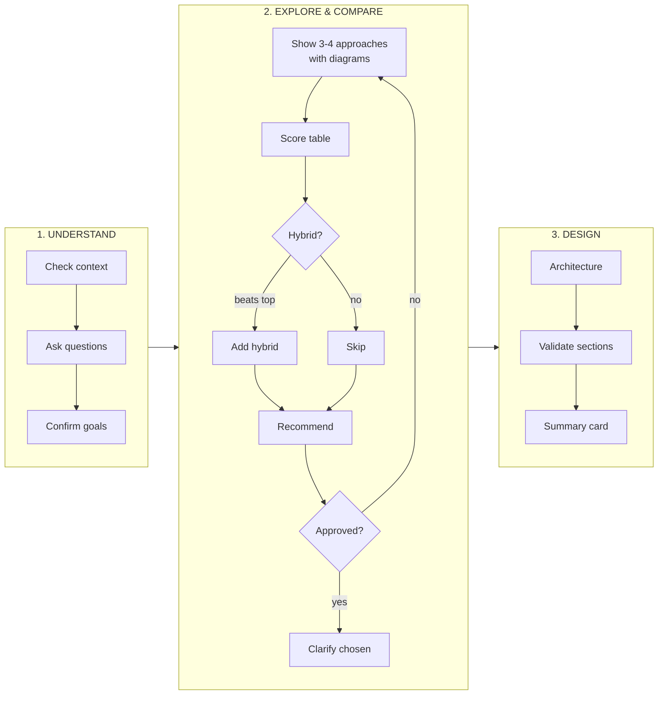

# SherpAI

AI-powered brainstorming skill that turns rough ideas into well-reasoned designs through systematic exploration.

## How it works

When you start building something, SherpAI doesn't let you jump into code. It steps back, asks what you're really trying to do, explores multiple approaches with systematic critique, and presents a validated design.



**The Three-Lens Critique:**
- **Direct Analysis** - What are the real trade-offs?
- **Analogy Lens** - What do similar systems teach us?
- **Domain Knowledge** - What do experts know about this space?

## Installation

### Claude Code (Recommended)

```bash
# Add marketplace and install
/plugin marketplace add bytemines/sherpai
/plugin install sherpai@sherpai-marketplace
```

### Claude Code (Alternative)

```bash
# Direct clone to plugins directory
git clone https://github.com/bytemines/sherpai.git ~/.claude/plugins/sherpai
```

### Codex

```
Fetch and follow instructions from https://raw.githubusercontent.com/bytemines/sherpai/main/.codex/INSTALL.md
```

### OpenCode

```
Fetch and follow instructions from https://raw.githubusercontent.com/bytemines/sherpai/main/.opencode/INSTALL.md
```

## Usage

The skill triggers automatically when you:
- Say "brainstorming" or "let's brainstorm"
- Start creative work (features, components, architecture)
- Ask to design or plan something

Or invoke directly: `/sherpai:brainstorming-mastermind`

## License

MIT
