# Sherpai 🏔️ - Don't free-solo your code. Let Sherpai guide the climb.


Some people climb 3,000 feet with no rope. They've also spent years memorizing every hold. You're not them. Neither am I.

Sherpai climbs with you in Claude Code, Codex, Gemini CLI, and beyond. It guides you through the messy parts: design, architecture, validation, planning. Step by step. No shortcuts to regret on the descent.

It's seen the summit. It's seen the falls.

## Current Skills

### Brainstorming Mastermind

The flagship skill. When you start building something, SherpAI doesn't let you jump into code. It steps back, asks what you're really trying to do, explores multiple approaches with systematic critique, and presents a validated design.

```mermaid
flowchart LR
    A((💭 Idea)) --> P1

    subgraph P1["1️⃣ UNDERSTAND"]
        direction TB
        B["📂 Check project state"]
        B --> C["❓ Ask questions"]
        C --> D["🔗 Dependent<br/><i>one at a time</i>"]
        C --> E["📦 Independent<br/><i>batch them</i>"]
        D --> F["🎯 Confirm goals"]
        E --> F
    end

    P1 --> P2

    subgraph P2["2️⃣ EXPLORE & COMPARE"]
        direction TB
        G["💡 3-4 Approaches"]
        H["✏️ Diagram + What/Win/Risk"]
        I["📊 Score table"]
        J["🔀 Hybrid check"]
        K["💬 Recommend"]
        G --> H --> I --> J --> K
    end

    P2 --> V1["👤 Approve?"]
    V1 -->|"🔄 Adjust"| P2
    V1 --> P3

    subgraph P3["3️⃣ DESIGN"]
        direction TB
        L["🏗️ Architecture diagram"]
        M["📑 Components & Data Flow"]
        N["✅ Validate sections"]
        O["📋 Summary card"]
        L --> M --> N --> O
    end

    P3 --> P["🚀 Build"]

    classDef phase1 fill:#e3f2fd,stroke:#1565c0,stroke-width:2px,color:#000
    classDef phase2 fill:#fff3e0,stroke:#ef6c00,stroke-width:2px,color:#000
    classDef phase3 fill:#f3e5f5,stroke:#7b1fa2,stroke-width:2px,color:#000
    classDef userCheck fill:#fff9c4,stroke:#f9a825,stroke-width:2px,color:#000
    classDef endpoint fill:#c8e6c9,stroke:#2e7d32,stroke-width:3px,color:#000

    class B,C,D,E,F phase1
    class G,H,I,J,K phase2
    class L,M,N,O phase3
    class V1 userCheck
    class A,P endpoint
```



**The Three-Lens Critique:**
- **Direct Analysis** - What are the real trade-offs?
- **Analogy Lens** - What do similar systems teach us?
- **Domain Knowledge** - What do experts know about this space?

## Installation

### Claude Code (Recommended)

```bash
# Add marketplace and install
/plugin marketplace add bytemines/sherpai
/plugin install sherpai@sherpai-marketplace
```

### Claude Code (Alternative)

```bash
# Direct clone to plugins directory
git clone https://github.com/bytemines/sherpai.git ~/.claude/plugins/sherpai
```

### Codex

```
Fetch and follow instructions from https://raw.githubusercontent.com/bytemines/sherpai/main/.codex/INSTALL.md
```

### OpenCode

```
Fetch and follow instructions from https://raw.githubusercontent.com/bytemines/sherpai/main/.opencode/INSTALL.md
```

## Usage

The brainstorming skill triggers automatically when you:
- Say "brainstorming" or "let's brainstorm"
- Start creative work (features, components, architecture)
- Ask to design or plan something

Or invoke directly: `/sherpai:brainstorming-mastermind`

## License

MIT
