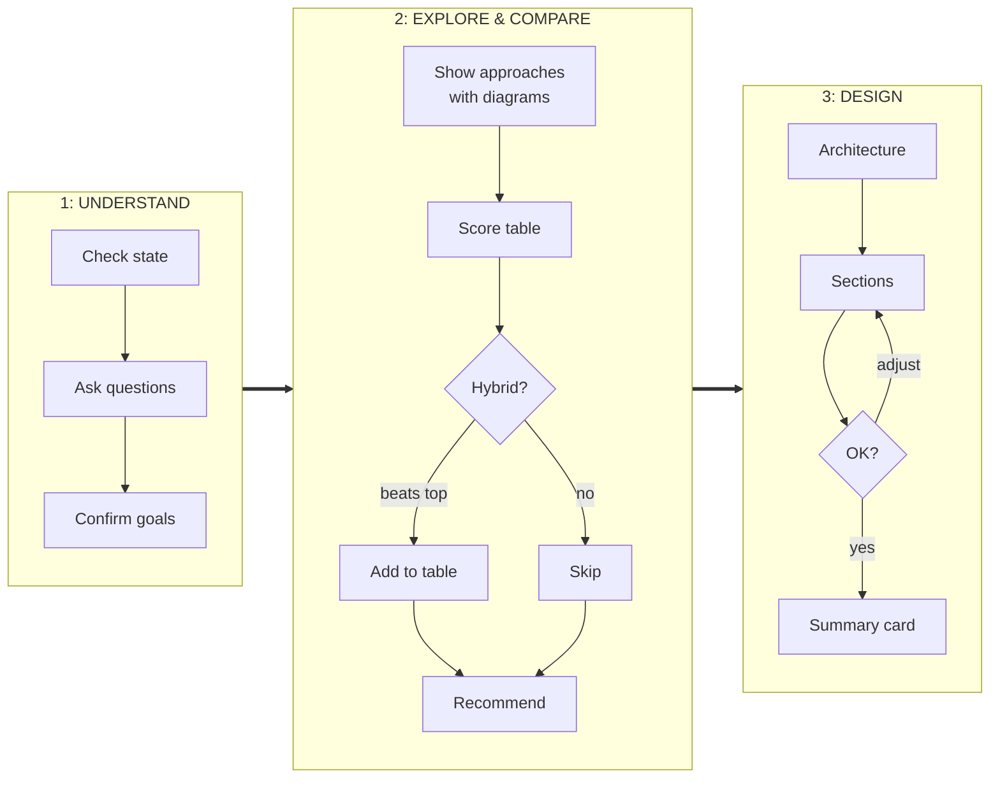
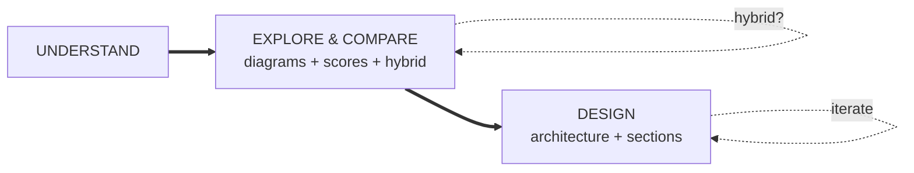
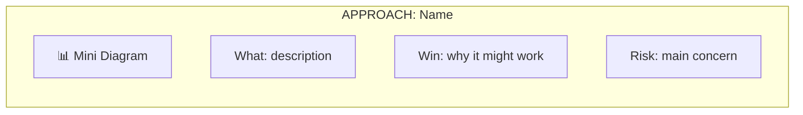

# Diagram Reference Guide

*Reference collection for ASCII and Mermaid diagrams - load only when creating architecture visualizations*

---

## ASCII Alignment Rules (Critical)

```
✓ CORRECT (uniform width, aligned edges):
┌──────────┐    ┌──────────┐    ┌──────────┐
│  Box A   │───▶│  Box B   │───▶│  Box C   │
└──────────┘    └──────────┘    └──────────┘

✗ WRONG (uneven widths, misaligned):
┌──────────┐    ┌───────┐    ┌─────────────┐
│  Box A   │───▶│ Box B │───▶│   Box C     │
└──────────┘    └───────┘    └─────────────┘
```

**Checklist before presenting:**
- [ ] All boxes in a row have **identical width**
- [ ] Vertical lines (`│`) align in columns
- [ ] Arrows (`───▶`) have consistent length
- [ ] Gaps between boxes are uniform (4 spaces)

---

## Essential Characters

**Box Drawing:**
```
Corners:    ┌  ┐  └  ┘
Edges:      │  ─
T-joins:    ├  ┤  ┬  ┴
Cross:      ┼
```

**Arrows:**
```
Single:     ───▶   ◀───   ▲   ▼
Bi-dir:     ◀───▶
```

---

## Pattern Reference

### Simple Component Flow
```
┌─────────────┐    ┌─────────────┐    ┌─────────────┐
│   Frontend  │───▶│   Backend   │───▶│  Database   │
└─────────────┘    └─────────────┘    └─────────────┘
```

### Decision Flow
```
       Start
         │
         ▼
    ┌──────────┐
    │Validation│
    └────┬─────┘
         │
       Valid?
      ┌──┴──┐
     Yes    No
      │     │
      ▼     ▼
   Process Error
```

### API Sequence
```
    Client             Server            Database
      │                  │                  │
      │─── Request ─────▶│                  │
      │                  │─── Query ───────▶│
      │                  │◀── Result ───────│
      │◀── Response ─────│                  │
```

### State Machine
```
[Idle] ──event──▶ [Processing] ──complete──▶ [Done]
   ▲                    │                      │
   └───── error ────────┘                      │
   ◀───── reset ───────────────────────────────┘
```

### File Structure
```
project/
├── src/
│   ├── components/
│   └── utils/
├── docs/
└── tests/
```

---

## Brainstorming Pipeline Visual (3 Phases)

```
┌─────────────┐      ┌─────────────────────┐      ┌─────────────┐
│  UNDERSTAND │ ───▶ │  EXPLORE & COMPARE  │ ───▶ │   DESIGN    │
│  (clarify)  │      │  (options + scores) │      │  (build it) │
└─────────────┘      └─────────────────────┘      └─────────────┘
```

### Detailed View

```
┌──────────────────────────────────────┐
│  PHASE 1: UNDERSTAND                 │
│  • Check project state               │
│  • Ask questions (dependent/batch)   │
│  • Confirm: purpose, constraints     │
└──────────────────┬───────────────────┘
                   │
                   ▼
┌──────────────────────────────────────┐
│  PHASE 2: EXPLORE & COMPARE          │
│  For EACH approach:                  │
│  • Mini diagram + What/Win/Risk      │
│  Then ONE comparison table:          │
│  • Scores (ROI, Simple, UX, etc.)    │
│  • Strengths/Weaknesses/Fails when   │
│  • Add hybrid if it beats top score  │
│  • Recommend winner                  │
└──────────────────┬───────────────────┘
                   │
                   ▼
┌──────────────────────────────────────┐
│  PHASE 3: DESIGN                     │
│  • Full architecture diagram         │
│  • Components, Data Flow, Errors     │
│  • Validate each section with user   │
│  • Summary card with trade-offs      │
└──────────────────────────────────────┘
```

---

## Mermaid Diagrams

### Main Workflow (3 Phases)



### Quick Reference



### Approach Card Pattern



---

*Use these patterns to communicate system design effectively.*
