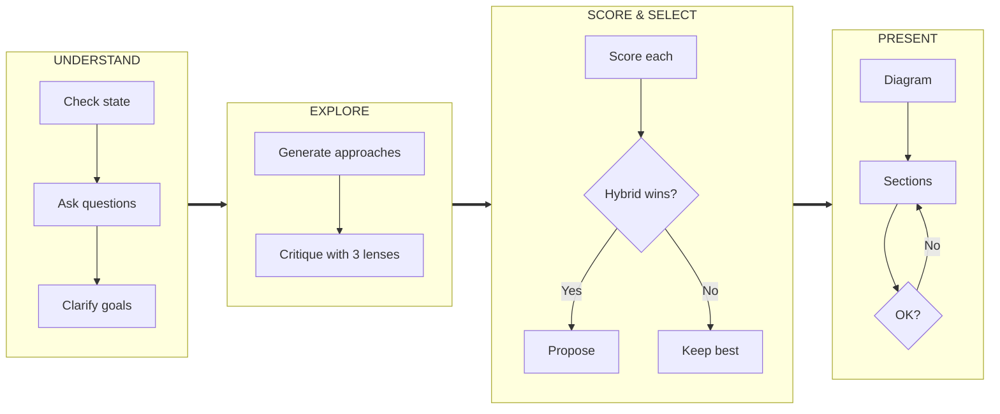
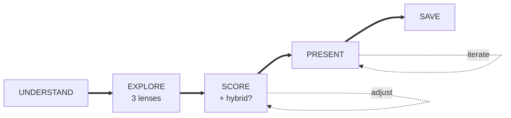

# Diagram Reference Guide

*Reference collection for ASCII and Mermaid diagrams - load only when creating architecture visualizations*

---

## ASCII Alignment Rules (Critical)

```
✓ CORRECT (uniform width, aligned edges):
┌──────────┐    ┌──────────┐    ┌──────────┐
│  Box A   │───▶│  Box B   │───▶│  Box C   │
└──────────┘    └──────────┘    └──────────┘

✗ WRONG (uneven widths, misaligned):
┌──────────┐    ┌───────┐    ┌─────────────┐
│  Box A   │───▶│ Box B │───▶│   Box C     │
└──────────┘    └───────┘    └─────────────┘
```

**Checklist before presenting:**
- [ ] All boxes in a row have **identical width**
- [ ] Vertical lines (`│`) align in columns
- [ ] Arrows (`───▶`) have consistent length
- [ ] Gaps between boxes are uniform (4 spaces)

---

## Essential Characters

**Box Drawing:**
```
Corners:    ┌  ┐  └  ┘
Edges:      │  ─
T-joins:    ├  ┤  ┬  ┴
Cross:      ┼
```

**Arrows:**
```
Single:     ───▶   ◀───   ▲   ▼
Bi-dir:     ◀───▶
```

---

## Pattern Reference

### Simple Component Flow
```
┌─────────────┐    ┌─────────────┐    ┌─────────────┐
│   Frontend  │───▶│   Backend   │───▶│  Database   │
└─────────────┘    └─────────────┘    └─────────────┘
```

### Decision Flow
```
       Start
         │
         ▼
    ┌──────────┐
    │Validation│
    └────┬─────┘
         │
       Valid?
      ┌──┴──┐
     Yes    No
      │     │
      ▼     ▼
   Process Error
```

### API Sequence
```
    Client             Server            Database
      │                  │                  │
      │─── Request ─────▶│                  │
      │                  │─── Query ───────▶│
      │                  │◀── Result ───────│
      │◀── Response ─────│                  │
```

### State Machine
```
[Idle] ──event──▶ [Processing] ──complete──▶ [Done]
   ▲                    │                      │
   └───── error ────────┘                      │
   ◀───── reset ───────────────────────────────┘
```

### File Structure
```
project/
├── src/
│   ├── components/
│   └── utils/
├── docs/
└── tests/
```

---

## Brainstorming Pipeline Visual

```
┌──────────────────────────────────────┐
│  PHASE 1: UNDERSTAND                 │
│  • Check project state               │
│  • Ask questions (dependent/batch)   │
│  • Clarify: purpose, constraints     │
└──────────────────┬───────────────────┘
                   │
                   ▼
┌──────────────────────────────────────┐
│  PHASE 2: GENERATE & EXPLORE         │
│  For EACH approach:                  │
│  1. Describe (what, why)             │
│  2. Find analogy (optional)          │
│  3. Critique with 3 lenses:          │
│     Direct | Analogy | Domain        │
└──────────────────┬───────────────────┘
                   │
                   ▼
┌──────────────────────────────────────┐
│  PHASE 3: SCORE & SELECT             │
│  • Score each (ROI, Simplicity, +3)  │
│  • Consider hybrid if it beats top   │
│  • Adjust and re-score if needed     │
│  • Recommend with reasoning          │
└──────────────────┬───────────────────┘
                   │
                   ▼
┌──────────────────────────────────────┐
│  PHASE 4: PRESENT FINAL DESIGN       │
│  • ASCII diagram (architecture)      │
│  • Present in sections (200-300w)    │
│  • Validate each section             │
│  • Final summary with trade-offs     │
└──────────────────────────────────────┘
```

---

## Three-Lens Critique Model

```
              ┌─────────────────────────────┐
              │   CRITIQUE THE APPROACH     │
              │      (the real problem)     │
              └──────────────┬──────────────┘
                             │
     ┌───────────────────────┼───────────────────────┐
     │                       │                       │
     ▼                       ▼                       ▼
┌─────────────┐        ┌─────────────┐        ┌─────────────┐
│   DIRECT    │        │   ANALOGY   │        │   DOMAIN    │
│  ANALYSIS   │        │    LENS     │        │  KNOWLEDGE  │
│             │        │             │        │             │
│ "What are   │        │ "What do    │        │ "What do I  │
│  the real   │        │  similar    │        │  know about │
│  trade-offs │        │  systems    │        │  this       │
│  here?"     │        │  teach us?" │        │  space?"    │
└─────────────┘        └─────────────┘        └─────────────┘
```

---

## Mermaid Diagrams

### Main Workflow (Horizontal)



### Quick Reference



---

*Use these patterns to communicate system design effectively.*
